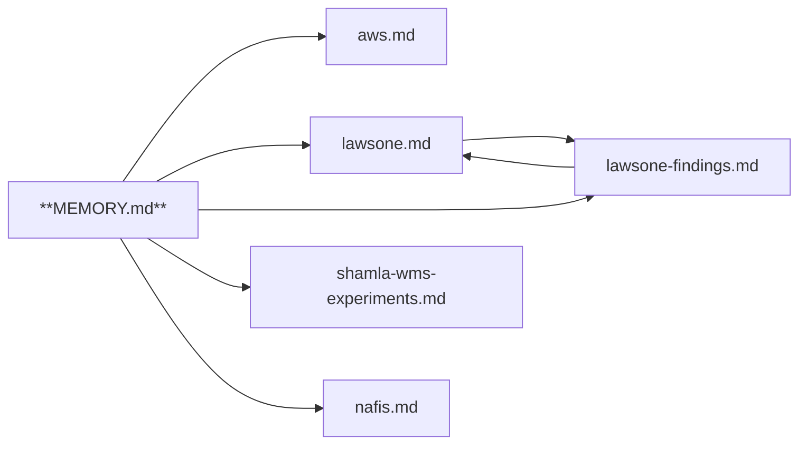

# memory-md

**Toolkit for [Agent Memory Repo](https://cognition.com/agent-memory-repo)** — the open standard Cognition released for agent memory (Oct 2026). Lint your memory repo, render the `[[wiki-link]]` graph, and dry-run Dreaming locally — no LLM, no writes.

`mem` is a zero-dependency Python CLI. It checks a memory repo against the spec (`MEMORY.md` entry point, one-line bullet entries, `[key: value]` metadata, `[[path]]` cross-links), then gives you the maintenance tools the standard doesn't ship.

```sh
pip install memory-md        # or: pipx install memory-md
mem lint /path/to/memory     # validate against the spec
```

## What it does

| Command | What you get |
|---|---|
| `mem lint` | Spec validation: broken `[[links]]`, dead `#anchors`, orphan files unreachable from `MEMORY.md`, bloated `MEMORY.md`, malformed metadata, duplicate index entries, unpushed commits |
| `mem dream` | Local dry-run of **Dreaming**: near-duplicate entries to merge, stale entries to verify, same-subject/different-number contradictions, unindexed files — advisory only, never writes |
| `mem graph` | The link graph as `mermaid` (renders on GitHub), `dot`, `json`, or `list` |
| `mem stats` | File/entry/link counts, `source:`/`added:` coverage, most-linked files |
| `mem init` | Scaffold a spec-compliant repo (git init + first commit) |
| `mem add` | Append a correctly formatted entry (`- text [source: …; added: …]`), optionally indexed |

## Quickstart

```sh
# scaffold a memory repo
mem init ~/memory-me --name Aws

# add an entry the spec way
mem add projects/payments "Launch deadline is 2026-10-15" \
    --source https://app.devin.ai/sessions/abc123 ~/memory-me --index

# check the whole repo against the standard
mem lint -v ~/memory-me
```

`mem add` produces spec-compliant lines automatically:

```markdown
- Launch deadline is 2026-10-15 [source: https://app.devin.ai/sessions/abc123; added: 2026-10-07]
```

## Dogfooded on a live Devin memory drive

Real output from `mem stats` on an actual agent memory drive (6 files, ~250 entries):

```
files:           6 (6 markdown, 0 other)
entries:         249
links:           7 (0 broken)
with source:     37/249 entries
with added date: 38/249 entries
reachable:       6/6 files from MEMORY.md
```

`mem dream` found 10 real duplicate entries that had drifted across two notes — exactly the cleanup Dreaming is meant to do. `mem lint` reported `0 error(s), 0 warning(s), 213 info` — mostly missing `source:`/`added:` metadata that older entries predate.

The link graph it renders (mermaid — GitHub renders this natively):



## Example: what lint catches

```
[error] MEMORY.md:6: broken-link: [[nowhere/ghost]] does not resolve to a file
[warning] MEMORY.md:9: dead-anchor: [[notes/x#missing-heading]] resolves but anchor '#missing-heading' matches no heading
[warning] orphan.md: orphan-file: unreachable from MEMORY.md — index it or link it from a note
[warning] MEMORY.md:5: duplicate-index-entry: index links [[team]] again (first on line 4)
[warning] team.md:3: bad-added-date: added: 'not-a-date' is not YYYY-MM-DD
```

## Use it inside CI of your memory repo

```yaml
- run: pip install memory-md && mem lint --strict .
```

`--strict` fails on warnings too; default fails only on errors. Info findings (missing `source:`/`added:`, unpushed commits) never fail.

## Install as an agent skill

The repo ships `skills/memory-md/SKILL.md`, so agents that support the skills format can install and drive the CLI themselves:

```sh
npx skills add Aws8/Opensourse --skill memory-md        # Claude Code, Cursor, …
devin plugins install Aws8/Opensourse                   # Devin
```

## Why this exists

Agent Memory Repo is three days old and growing fast (spec repo passed 500 stars in its first weekend). The standard defines the format, the memory loop, and Dreaming — but ships no tooling. `mem` is the missing toolkit: the linter every format eventually gets, plus a local stand-in for Dreaming you can run between its cycles.

## Spec compliance

- `[[path]]` resolves with `.md` optional (Markdown) and required (other extensions); `#anchors` checked against heading slugs
- Metadata parsed as `[key: value; key: value]` — URLs with `:` don't split
- Links inside fenced code blocks and inline `code` don't count
- Nested bullets (Q&A threads) are entries, not errors
- Git checks: uncommitted changes, missing remote, unpushed commits — the memory loop says *push after every edit*

## License

MIT
